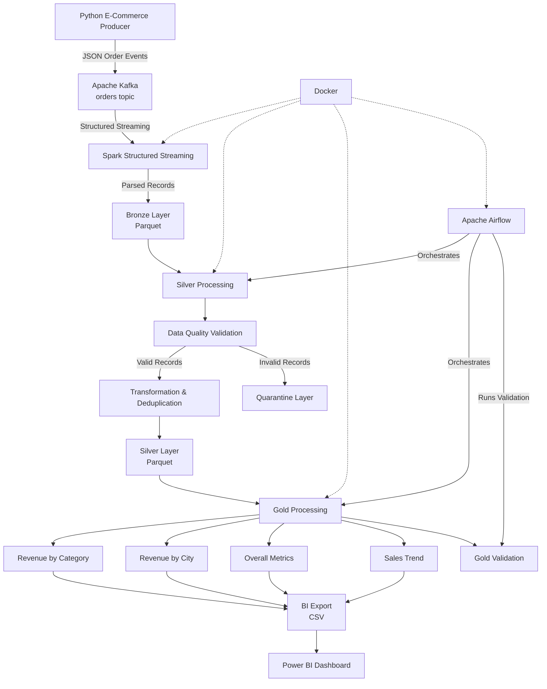
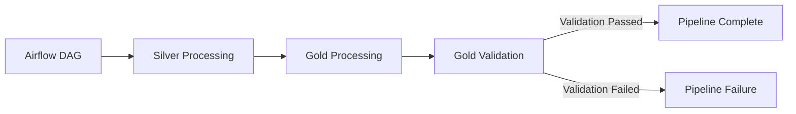

# System Architecture

## Real-Time E-Commerce Data Platform



---

## End-to-End Data Flow

```text
Python Producer
      │
      ▼
Apache Kafka
      │
      ▼
Spark Structured Streaming
      │
      ▼
Bronze Parquet
      │
      ▼
Silver Processing
      │
      ├──────────────► Quarantine
      │                 Invalid Records
      │
      ▼
Silver Parquet
      │
      ▼
Gold Processing
      │
      ├── Revenue by Category
      ├── Revenue by City
      ├── Overall Metrics
      └── Sales Trend
      │
      ▼
BI Export
      │
      ▼
Power BI
```

---

## Processing Responsibilities

| Layer | Responsibility |
|---|---|
| Producer | Generate e-commerce order events |
| Kafka | Buffer and decouple event ingestion |
| Bronze | Persist source-oriented streaming data |
| Silver | Validate, transform and deduplicate data |
| Quarantine | Preserve invalid records for investigation |
| Gold | Generate business-level analytical datasets |
| BI Export | Convert Gold Parquet into reporting-ready CSV |
| Power BI | Visualize business KPIs and trends |
| Airflow | Orchestrate processing and validation |
| Docker | Provide reproducible execution environments |

---

## Orchestration Flow



The current Airflow workflow is:

```text
Silver Processing
       ↓
Gold Processing
       ↓
Gold Validation
```

---

## Storage Architecture

```text
spark/
│
├── bronze/
│   └── Raw parsed Kafka events
│
├── silver/
│   └── Validated and deduplicated records
│
├── quarantine/
│   └── Invalid records
│
├── gold/
│   ├── revenue_by_category/
│   ├── revenue_by_city/
│   ├── overall_metrics/
│   └── sales_trend/
│
└── bi_export/
    ├── revenue_by_category.csv
    ├── revenue_by_city.csv
    ├── overall_metrics.csv
    └── sales_trend.csv
```